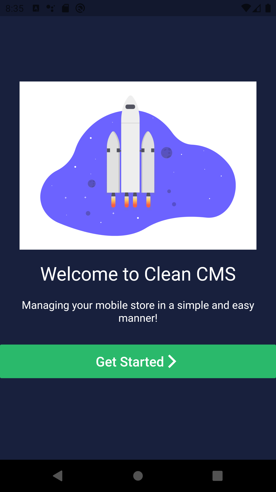

# Clean CMS powered by Firebase

 

## Description
You can make changes in the app and it will be reflected in the clean login app. This CMS controls my  [Firebase-Login](https://github.com/Rift3000/Firebase-Login-) app.
 
 

## Gif

  

## ScreenShots

  
  &nbsp;&nbsp;
  

 

  
  &nbsp;&nbsp;
  

 

  
  &nbsp;&nbsp;
  

 

  
  &nbsp;&nbsp;
  

